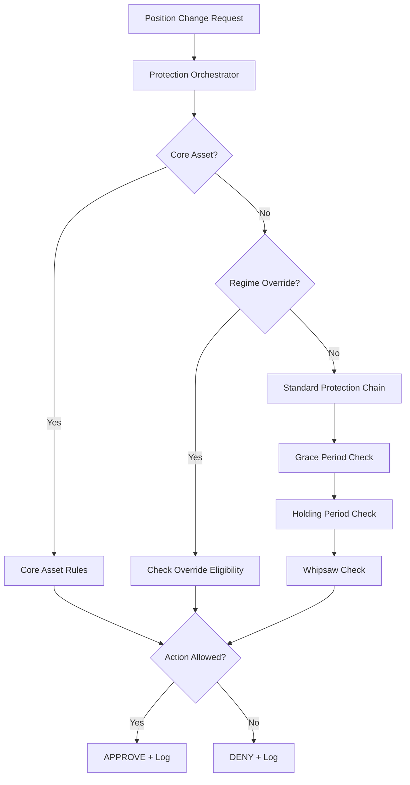

# Module 8: Protection System Orchestrator - Implementation Plan

**Implementation Date:** TBD  
**Status:** 📋 PLANNING  
**Priority:** HIGH - Critical Risk Management Integration  
**Estimated Effort:** 1-2 days (unified protection coordination)  
**Dependencies:** Modules 1-7, 9 ✅ (All completed)

---

## 📋 Module Overview

Module 8 implements a unified Protection System Orchestrator that coordinates all protection mechanisms (grace periods, holding periods, whipsaw protection, regime overrides, and core asset immunity) with a clear priority hierarchy and centralized decision-making.

### **Strategic Importance:**
- **Unified Protection Logic**: Single point for all protection decisions
- **Priority Hierarchy**: Clear conflict resolution between protection systems
- **Centralized Control**: Eliminates protection system conflicts and edge cases
- **Complete Integration**: Seamless integration with rebalancing engine
- **Audit Trail**: All protection decisions logged through Module 9

---

## 🎯 Technical Architecture

### **Design Philosophy: Single Decision Authority**

**Core Principle**: All position changes must be approved by the Protection Orchestrator before execution. This eliminates conflicts between protection systems and ensures consistent behavior.

### **Protection Priority Hierarchy**

```python
PROTECTION_PRIORITY_HIERARCHY = {
    1: 'core_asset_immunity',      # Core assets always protected (highest priority)
    2: 'regime_override',          # Regime changes can override other systems
    3: 'grace_period',             # Grace periods for failing assets
    4: 'holding_period',           # Minimum holding periods
    5: 'whipsaw_protection'        # Prevent rapid cycling (lowest priority)
}
```

### **Decision Flow Architecture**



---

## 🏗️ Implementation Strategy

### **Phase 1: Core Orchestrator Infrastructure**
**Duration:** 4-6 hours  
**Components:** ProtectionOrchestrator, Decision Models, Priority Engine

#### **Objectives:**
1. **Centralized Decision Engine**: Single authority for all protection decisions
2. **Priority Hierarchy Implementation**: Clear conflict resolution rules
3. **Decision Models**: Standardized request/response structures
4. **Event Integration**: Complete audit trail through Module 9

#### **Deliverables:**
1. **`ProtectionOrchestrator`** - Central decision authority
2. **`ProtectionDecision`** - Standardized decision model
3. **`ProtectionRequest`** - Request structure with context
4. **Priority resolution engine with conflict handling**

### **Phase 2: Protection System Integration**
**Duration:** 4-6 hours  
**Components:** Manager Integration, Override Logic, Context Handling

#### **Objectives:**
1. **Manager Integration**: Connect all existing protection managers
2. **Override Logic**: Implement regime and core asset overrides
3. **Context Handling**: Rich context for protection decisions
4. **Performance Optimization**: Efficient decision processing

#### **Deliverables:**
1. **Protection manager integration adapters**
2. **Regime override implementation with cooldowns**
3. **Core asset immunity integration**
4. **Context-aware decision making**

### **Phase 3: Rebalancer Engine Integration**
**Duration:** 2-4 hours  
**Components:** Engine Hooks, Decision Validation, Error Handling

#### **Objectives:**
1. **Rebalancer Hooks**: Integration with enhanced rebalancer engine
2. **Decision Validation**: Validate all position changes before execution
3. **Error Handling**: Robust error handling for protection failures
4. **Performance Monitoring**: Track orchestrator performance

#### **Deliverables:**
1. **Rebalancer engine integration**
2. **Pre-execution validation hooks**
3. **Comprehensive error handling**
4. **Performance monitoring integration**

---

## 🔧 Technical Specifications

### **1. ProtectionOrchestrator - Central Decision Authority**

```python
class ProtectionOrchestrator:
    """
    Unified protection system orchestrator with priority hierarchy.
    
    Coordinates all protection mechanisms:
    - Core asset immunity (priority 1)
    - Regime overrides (priority 2) 
    - Grace periods (priority 3)
    - Holding periods (priority 4)
    - Whipsaw protection (priority 5)
    """
    
    def __init__(self, 
                 core_asset_manager: CoreAssetManager,
                 grace_period_manager: GracePeriodManager,
                 holding_period_manager: HoldingPeriodManager,
                 whipsaw_protection_manager: WhipsawProtectionManager,
                 regime_context_provider: RegimeContextProvider,
                 event_writer: EventWriter = None):
        """
        Initialize protection orchestrator with all protection systems.
        
        Args:
            core_asset_manager: Core asset management system
            grace_period_manager: Grace period protection
            holding_period_manager: Holding period enforcement
            whipsaw_protection_manager: Whipsaw cycle prevention
            regime_context_provider: Regime change context
            event_writer: Event logging system
        """
        self.core_asset_manager = core_asset_manager
        self.grace_period_manager = grace_period_manager
        self.holding_period_manager = holding_period_manager
        self.whipsaw_protection_manager = whipsaw_protection_manager
        self.regime_context_provider = regime_context_provider
        self.event_writer = event_writer or get_event_writer()
        
        # Priority hierarchy
        self.priority_hierarchy = {
            1: 'core_asset_immunity',
            2: 'regime_override', 
            3: 'grace_period',
            4: 'holding_period',
            5: 'whipsaw_protection'
        }
        
        # Performance tracking
        self.decisions_processed = 0
        self.decisions_approved = 0
        self.decisions_denied = 0
        self.override_count = 0
        
        # Log orchestrator initialization
        self.event_writer.log_event(
            event_type='protection_orchestrator_init',
            event_category='protection',
            action='init',
            reason='Protection orchestrator initialized',
            metadata={
                'priority_hierarchy': self.priority_hierarchy,
                'managers_enabled': {
                    'core_asset': core_asset_manager is not None,
                    'grace_period': grace_period_manager is not None,
                    'holding_period': holding_period_manager is not None,
                    'whipsaw_protection': whipsaw_protection_manager is not None
                }
            }
        )
    
    def can_execute_action(self, request: ProtectionRequest) -> ProtectionDecision:
        """
        Central decision authority for all position actions.
        
        Args:
            request: Protection request with action details
            
        Returns:
            ProtectionDecision with approval/denial and detailed reasoning
        """
        self.decisions_processed += 1
        decision_start_time = time.time()
        
        try:
            # Generate decision trace ID
            decision_trace_id = self.event_writer.start_trace(
                f'protection_decision_{request.asset}_{request.action}'
            )
            
            # Log decision request
            self.event_writer.log_event(
                event_type='protection_decision_start',
                event_category='protection',
                action='start',
                reason=f'Protection decision requested: {request.action} {request.asset}',
                asset=request.asset,
                trace_id=decision_trace_id,
                metadata={
                    'action': request.action,
                    'current_size': request.current_size,
                    'target_size': request.target_size,
                    'current_score': request.current_score,
                    'reason': request.reason
                }
            )
            
            # Apply protection hierarchy
            decision = self._apply_protection_hierarchy(request, decision_trace_id)
            
            # Update statistics
            if decision.approved:
                self.decisions_approved += 1
            else:
                self.decisions_denied += 1
            
            if decision.override_applied:
                self.override_count += 1
            
            decision_time = (time.time() - decision_start_time) * 1000
            
            # Log final decision
            self.event_writer.log_event(
                event_type='protection_decision_complete',
                event_category='protection',
                action='approve' if decision.approved else 'deny',
                reason=decision.reason,
                asset=request.asset,
                trace_id=decision_trace_id,
                execution_time_ms=decision_time,
                metadata={
                    'approved': decision.approved,
                    'blocking_systems': decision.blocking_systems,
                    'override_applied': decision.override_applied,
                    'override_reason': decision.override_reason,
                    'decision_hierarchy': decision.decision_hierarchy,
                    'performance_stats': {
                        'decisions_processed': self.decisions_processed,
                        'approval_rate': self.decisions_approved / self.decisions_processed,
                        'override_rate': self.override_count / self.decisions_processed
                    }
                }
            )
            
            self.event_writer.end_trace(decision_trace_id, success=True)
            
            return decision
            
        except Exception as e:
            decision_time = (time.time() - decision_start_time) * 1000
            
            # Log decision error
            self.event_writer.log_error(
                error_type='protection_decision',
                error_message=f'Protection decision failed: {str(e)}',
                asset=request.asset,
                metadata={
                    'action': request.action,
                    'execution_time_ms': decision_time,
                    'error_type': type(e).__name__
                }
            )
            
            # Return conservative decision (deny on error)
            return ProtectionDecision(
                approved=False,
                reason=f'Protection decision failed: {str(e)}',
                blocking_systems=['error'],
                override_applied=False
            )
    
    def _apply_protection_hierarchy(self, request: ProtectionRequest, 
                                  trace_id: str) -> ProtectionDecision:
        """
        Apply protection hierarchy with override logic.
        
        Args:
            request: Protection request
            trace_id: Trace ID for event logging
            
        Returns:
            ProtectionDecision with detailed reasoning
        """
        
        # Initialize decision tracking
        protection_results = []
        blocking_systems = []
        override_applied = False
        override_reason = None
        
        # Get regime context for override decisions
        regime_context = self.regime_context_provider.get_regime_context(request.current_date)
        
        # Priority 1: Core Asset Immunity (highest priority)
        core_result = self._check_core_asset_immunity(request, trace_id)
        protection_results.append(core_result)
        
        if core_result.blocks_action:
            return ProtectionDecision(
                approved=False,
                reason=core_result.reason,
                blocking_systems=[core_result.system_name],
                override_applied=False,
                decision_hierarchy=protection_results
            )
        
        # Priority 2: Regime Override Check
        regime_override_available = self._check_regime_override_availability(
            request, regime_context, trace_id
        )
        
        # Priority 3-5: Standard Protection Chain
        protection_checks = [
            ('grace_period', self._check_grace_period_protection),
            ('holding_period', self._check_holding_period_protection),
            ('whipsaw_protection', self._check_whipsaw_protection)
        ]
        
        for system_name, check_function in protection_checks:
            result = check_function(request, trace_id)
            protection_results.append(result)
            
            if result.blocks_action:
                # Check if regime override can bypass this protection
                if (regime_override_available and 
                    self._can_regime_override_system(system_name, regime_context)):
                    
                    # Apply regime override
                    override_applied = True
                    override_reason = f"Regime override bypassed {system_name}: {regime_context['regime_severity']} severity {regime_context['new_regime']} transition"
                    
                    # Log override application
                    self.event_writer.log_event(
                        event_type='protection_override_applied',
                        event_category='protection',
                        action='override',
                        reason=override_reason,
                        asset=request.asset,
                        trace_id=trace_id,
                        regime=regime_context.get('new_regime'),
                        metadata={
                            'overridden_system': system_name,
                            'regime_severity': regime_context.get('regime_severity'),
                            'original_block_reason': result.reason
                        }
                    )
                    
                    # Continue to next protection check
                    continue
                else:
                    # Cannot override, action is blocked
                    blocking_systems.append(system_name)
        
        # Determine final decision
        if blocking_systems:
            # Action blocked by unoverrideable systems
            return ProtectionDecision(
                approved=False,
                reason=f"Action blocked by: {', '.join(blocking_systems)}",
                blocking_systems=blocking_systems,
                override_applied=override_applied,
                override_reason=override_reason,
                decision_hierarchy=protection_results
            )
        else:
            # Action approved
            approval_reason = "All protection checks passed"
            if override_applied:
                approval_reason += f" (with regime override: {override_reason})"
            
            return ProtectionDecision(
                approved=True,
                reason=approval_reason,
                blocking_systems=[],
                override_applied=override_applied,
                override_reason=override_reason,
                decision_hierarchy=protection_results
            )
```

### **2. ProtectionRequest - Standardized Request Model**

```python
@dataclass
class ProtectionRequest:
    """
    Standardized protection request with complete context.
    """
    asset: str
    action: str  # 'open', 'close', 'increase', 'decrease'
    current_date: datetime
    current_size: Optional[float] = None
    target_size: Optional[float] = None
    current_score: Optional[float] = None
    target_score: Optional[float] = None
    reason: str = ""
    
    # Position context
    position_entry_date: Optional[datetime] = None
    position_entry_score: Optional[float] = None
    position_entry_size: Optional[float] = None
    
    # Portfolio context
    portfolio_allocation: Optional[float] = None
    active_positions: Optional[int] = None
    
    # Additional metadata
    metadata: Dict[str, Any] = field(default_factory=dict)
    
    def validate(self) -> bool:
        """Validate request has required fields."""
        required_fields = ['asset', 'action', 'current_date']
        return all(getattr(self, field) is not None for field in required_fields)
```

### **3. ProtectionDecision - Standardized Decision Model**

```python
@dataclass 
class ProtectionDecision:
    """
    Standardized protection decision with complete reasoning.
    """
    approved: bool
    reason: str
    blocking_systems: List[str] = field(default_factory=list)
    override_applied: bool = False
    override_reason: Optional[str] = None
    decision_hierarchy: List['ProtectionResult'] = field(default_factory=list)
    decision_time_ms: Optional[float] = None
    
    def to_dict(self) -> Dict[str, Any]:
        """Convert decision to dictionary for logging."""
        return {
            'approved': self.approved,
            'reason': self.reason,
            'blocking_systems': self.blocking_systems,
            'override_applied': self.override_applied,
            'override_reason': self.override_reason,
            'decision_time_ms': self.decision_time_ms,
            'protection_checks': len(self.decision_hierarchy)
        }

@dataclass
class ProtectionResult:
    """Result from individual protection system check."""
    system_name: str
    blocks_action: bool
    reason: str
    priority: int
    check_time_ms: Optional[float] = None
    metadata: Dict[str, Any] = field(default_factory=dict)
```

---

## 🔗 Rebalancer Engine Integration

### **Enhanced Rebalancer with Protection Validation**

```python
class ProtectionAwareRebalancerEngine(EnhancedCoreRebalancerEngine):
    """
    Enhanced rebalancer engine with protection orchestrator integration.
    """
    
    def __init__(self, regime_detector, asset_manager, 
                 technical_analyzer=None, fundamental_analyzer=None,
                 data_manager=None, event_writer=None):
        
        super().__init__(regime_detector, asset_manager, technical_analyzer, 
                        fundamental_analyzer, data_manager, event_writer)
        
        # Initialize protection orchestrator
        self.protection_orchestrator = ProtectionOrchestrator(
            core_asset_manager=self.core_asset_manager,
            grace_period_manager=self.grace_period_manager,
            holding_period_manager=self.holding_period_manager,
            whipsaw_protection_manager=self.whipsaw_protection,
            regime_context_provider=self.regime_context_provider,
            event_writer=self.event_writer
        )
    
    def _validate_position_changes_with_protection(self, targets: List[RebalancingTarget],
                                                 current_date: datetime) -> List[RebalancingTarget]:
        """
        Validate all position changes through protection orchestrator.
        
        Args:
            targets: Proposed rebalancing targets
            current_date: Current date
            
        Returns:
            Filtered list of approved targets
        """
        
        validation_trace_id = self.event_writer.start_trace('protection_validation_batch')
        
        try:
            approved_targets = []
            denied_targets = []
            
            for target in targets:
                # Create protection request
                request = ProtectionRequest(
                    asset=target.asset,
                    action=target.action,
                    current_date=current_date,
                    current_size=target.current_allocation_pct,
                    target_size=target.target_allocation_pct,
                    current_score=target.score,
                    reason=target.reason,
                    metadata={
                        'priority': target.priority.value,
                        'rebalancing_context': True
                    }
                )
                
                # Get protection decision
                decision = self.protection_orchestrator.can_execute_action(request)
                
                if decision.approved:
                    approved_targets.append(target)
                    # Update target with protection metadata
                    target.metadata = target.metadata or {}
                    target.metadata['protection_decision'] = decision.to_dict()
                else:
                    denied_targets.append(target)
                    # Log denied target
                    self.event_writer.log_event(
                        event_type='rebalancing_target_denied',
                        event_category='protection',
                        action='deny',
                        reason=f'Target denied by protection: {decision.reason}',
                        asset=target.asset,
                        trace_id=validation_trace_id,
                        metadata={
                            'original_action': target.action,
                            'blocking_systems': decision.blocking_systems,
                            'decision': decision.to_dict()
                        }
                    )
            
            # Log validation summary
            self.event_writer.log_event(
                event_type='protection_validation_complete',
                event_category='protection',
                action='validate',
                reason=f'Protection validation: {len(approved_targets)} approved, {len(denied_targets)} denied',
                trace_id=validation_trace_id,
                metadata={
                    'total_targets': len(targets),
                    'approved_targets': len(approved_targets),
                    'denied_targets': len(denied_targets),
                    'approval_rate': len(approved_targets) / len(targets) if targets else 0
                }
            )
            
            return approved_targets
            
        finally:
            self.event_writer.end_trace(validation_trace_id)
```

---

## 📋 Implementation Checklist

### **Phase 1: Core Orchestrator Infrastructure** ⏳
- [ ] `ProtectionOrchestrator` class with priority hierarchy
- [ ] `ProtectionRequest` and `ProtectionDecision` models
- [ ] `ProtectionResult` for individual system results
- [ ] Priority resolution engine implementation
- [ ] Core asset immunity integration
- [ ] Event logging integration
- [ ] Unit tests for orchestrator core

### **Phase 2: Protection System Integration** ⏳
- [ ] Grace period manager integration
- [ ] Holding period manager integration  
- [ ] Whipsaw protection manager integration
- [ ] Regime override logic implementation
- [ ] Context-aware decision making
- [ ] Override cooldown management
- [ ] Performance optimization
- [ ] Integration tests with all managers

### **Phase 3: Rebalancer Engine Integration** ⏳
- [ ] `ProtectionAwareRebalancerEngine` implementation
- [ ] Pre-execution validation hooks
- [ ] Target filtering and approval workflow
- [ ] Error handling and recovery
- [ ] Performance monitoring integration
- [ ] End-to-end integration tests
- [ ] Performance benchmarking

---

## 🎯 Success Metrics

### **Functional Metrics**
- **Conflict Resolution**: 100% of protection conflicts resolved by hierarchy
- **Decision Consistency**: No contradictory protection decisions
- **Override Accuracy**: Regime overrides applied only when appropriate
- **Integration Completeness**: All position changes validated through orchestrator

### **Performance Metrics**
- **Decision Speed**: <5ms average protection decision time
- **Throughput**: >1000 decisions per second under load
- **Memory Usage**: <50MB additional memory overhead
- **Error Rate**: <0.1% protection decision failures

### **Operational Metrics**
- **Audit Completeness**: 100% of protection decisions logged
- **Error Handling**: Graceful degradation on component failures
- **System Health**: Real-time protection system status monitoring
- **Alert Generation**: Automated alerts for protection system issues

---

## 🔮 Advanced Features (Future Enhancements)

### **Adaptive Protection Parameters**
- Machine learning optimization of protection parameters
- Dynamic adjustment based on market conditions
- Backtesting-driven parameter optimization
- A/B testing framework for protection strategies

### **Advanced Override Logic**
- Multi-factor regime severity calculation
- Volatility-adjusted protection parameters
- Correlation-based override decisions
- Market microstructure considerations

### **Enhanced Monitoring**
- Real-time protection effectiveness dashboard
- Protection system performance analytics
- Predictive protection alerts
- Advanced pattern recognition in protection events

---

**This unified Protection Orchestrator will eliminate all protection system conflicts while maintaining complete audit trails and providing institutional-grade risk management coordination.** 🛡️